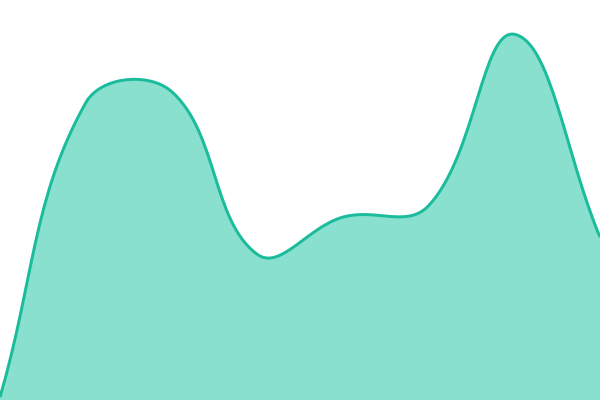
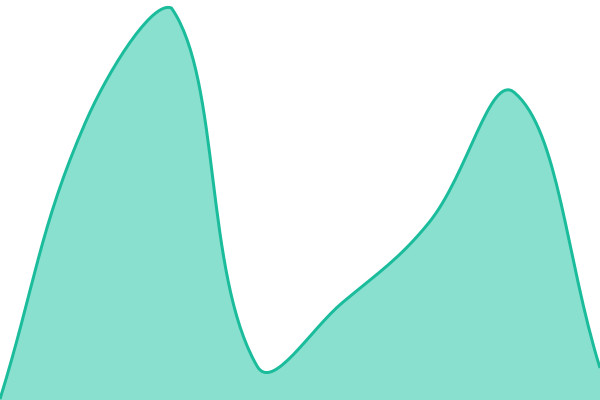
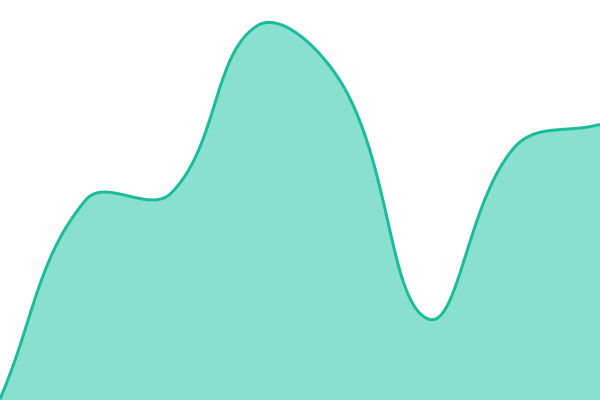
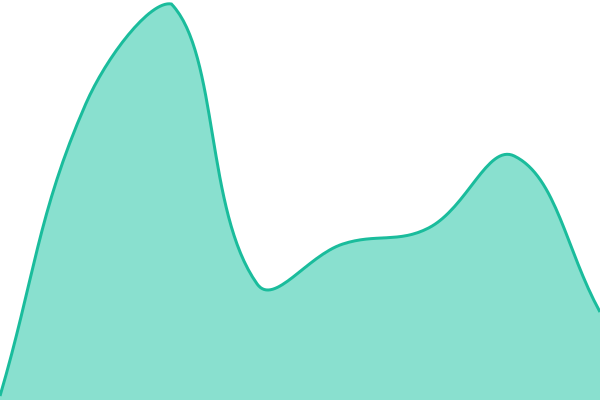

# Kvedo statuss

Publiskā Kvedo statusa lapa: https://status.kvedo.com (Upptime, GitHub Actions + Pages).

## [Live Status](https://status.kvedo.com): <!--live status--> **Visas sistēmas darbojas**

<!--start: status pages-->
<!-- This summary is generated by Upptime (https://github.com/upptime/upptime) -->
<!-- Do not edit this manually, your changes will be overwritten -->
<!-- prettier-ignore -->
| URL | Status | History | Response Time | Uptime |
| --- | ------ | ------- | ------------- | ------ |
|  [Google](https://www.google.com) | 🟩 Up | [google.yml](https://github.com/upptime/upptime/commits/HEAD/history/google.yml) | 

 83ms
     
 | 

<a href="https://demo.upptime.js.org/history/google">100.00%</a>
    

|  [Wikipedia](https://en.wikipedia.org) | 🟩 Up | [wikipedia.yml](https://github.com/upptime/upptime/commits/HEAD/history/wikipedia.yml) | 

 212ms
     
 | 

<a href="https://demo.upptime.js.org/history/wikipedia">100.00%</a>
    

|  [Hacker News](https://news.ycombinator.com) | 🟩 Up | [hacker-news.yml](https://github.com/upptime/upptime/commits/HEAD/history/hacker-news.yml) | 

 274ms
     
 | 

<a href="https://demo.upptime.js.org/history/hacker-news">100.00%</a>
    

|  Secret Site | 🟩 Up | [secret-site.yml](https://github.com/upptime/upptime/commits/HEAD/history/secret-site.yml) | 

 52ms
     
 | 

<a href="https://demo.upptime.js.org/history/secret-site">100.00%</a>
    

<!--end: status pages-->

Konfigurācija: `.upptimerc.yml`. Template auto-update ir izslēgts, actions piesprausti pie commit SHA.
